# 移动互联网期末PJ 投票网站Voter

14307130356 卢颖


## 功能说明
* 登录注册
* 发起投票
* 搜索投票
* 关闭投票
* 实时更新投票结果（*）

注明：其中 * 功能并没有测试完全，只是用sockect.io实现了一下，并且运行时候没有报错，很可能有潜在的BUG。


## 网站逻辑逻辑
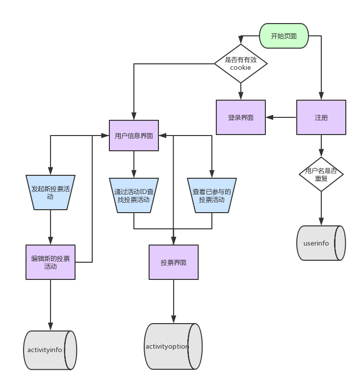

## 数据库构建

```
数据库Voter中的所有表格，共有三张：
 * activityinfo用于记录一次投票的信息
 * activityoption用于记录用户在一次投票中选择的选项
 * userinfo用于记录用户的具体信息，其中除了uid外，用户名username也唯一。
 
+-----------------+
| Tables_in_voter |
+-----------------+
| activityinfo    |
| activityoption  |
| userinfo        |
+-----------------+

  Fig 1. 三张表格

+----------+-------------+------+-----+---------+----------------+
| Field    | Type        | Null | Key | Default | Extra          |
+----------+-------------+------+-----+---------+----------------+
| uid      | int(11)     | NO   | PRI | NULL    | auto_increment |
| username | varchar(50) | YES  |     | NULL    |                |
| password | varchar(40) | YES  |     | NULL    |                |
| nickname | varchar(50) | YES  |     | NULL    |                |
+----------+-------------+------+-----+---------+----------------+

Fig 2. userinfo表，包含用户ID(uid)，用户名(usernmame)，密码(password)
		和昵称(nickname)四个字段

+--------------+-------------+------+-----+---------+----------------+
| Field        | Type        | Null | Key | Default | Extra          |
+--------------+-------------+------+-----+---------+----------------+
| aid          | int(11)     | NO   | PRI | NULL    | auto_increment |
| activityname | varchar(50) | YES  |     | NULL    |                |
| starter      | varchar(50) | YES  |     | NULL    |                |
| votetype     | varchar(50) | YES  |     | NULL    |                |
| votestatus   | int(11)     | YES  |     | NULL    |                |
| content      | varchar(50) | YES  |     | NULL    |                |
| totalnum     | varchar(50) | YES  |     | NULL    |                |
+--------------+-------------+------+-----+---------+----------------+
Figure 3. activityinfo表，包含活动id，活动名称，发起人，投票类型，投票状态(开启
			/关闭),投票生成表格的行列名称(content)，所有参与者的投票统计结果
			(totalnum)

+----------+--------------+------+-----+---------+----------------+
| Field    | Type         | Null | Key | Default | Extra          |
+----------+--------------+------+-----+---------+----------------+
| oid      | int(11)      | NO   | PRI | NULL    | auto_increment |
| aid      | int(11)      | YES  |     | NULL    |                |
| username | varchar(50)  | YES  |     | NULL    |                |
| content  | varchar(100) | YES  |     | NULL    |                |
+----------+--------------+------+-----+---------+----------------+
Figure 4. activityoption表，包含主键oid，活动id，投票者的用户名和具体选项
			（content）		

```


## 使用说明

网页使用了nodejs的express框架，为确保能够运行运行，请在Mysql中创建数据库Voter和三张表格。由于删掉了node_modules库，但是package.json文件还在，可以尝试通过
```
	npm install --save
```
来安装。

然后在PJ的Voter目录下执行

```
	npm start
```

网站运行在默认的3000端口，输入127.0.0.1:3000就可以访问主页，因为时间仓促，一切以实现功能为目的，前端写得有点丑，很多地方地方没有对齐居中。

### 主页、注册、登录
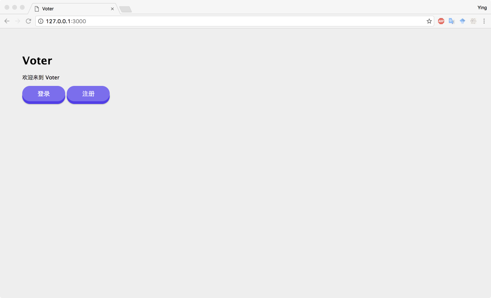
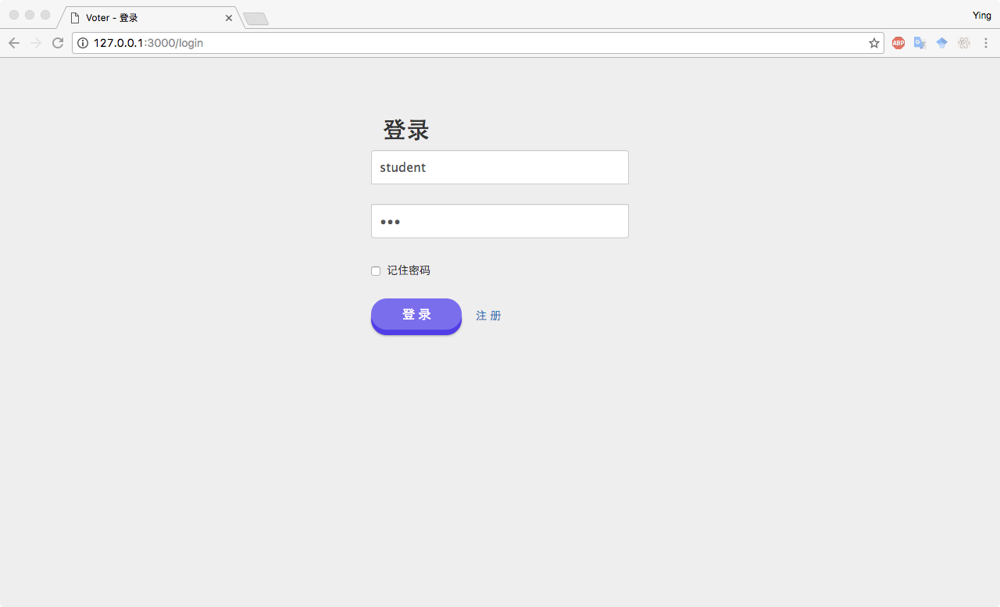
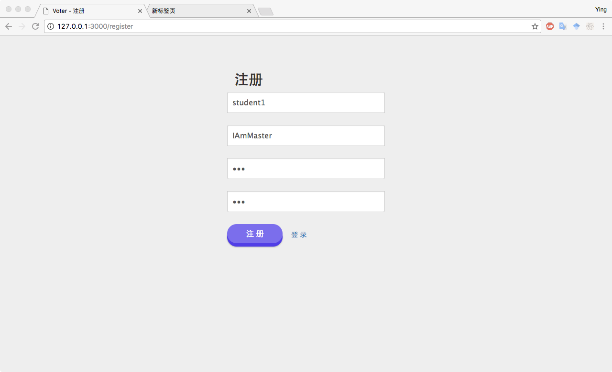

### 个人信息、发起新投票
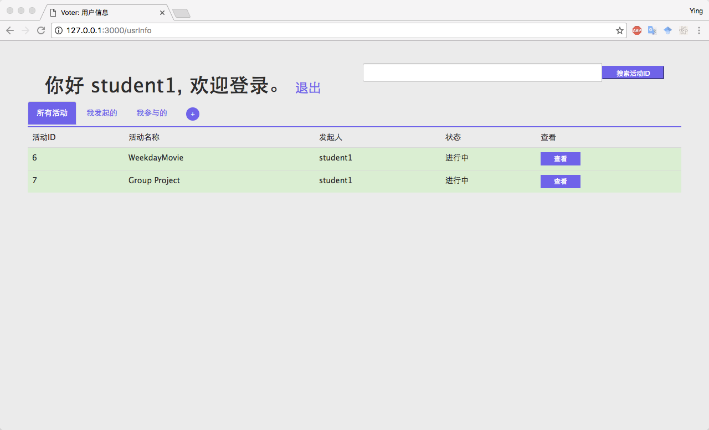
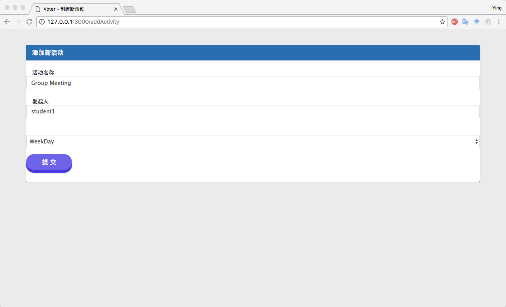
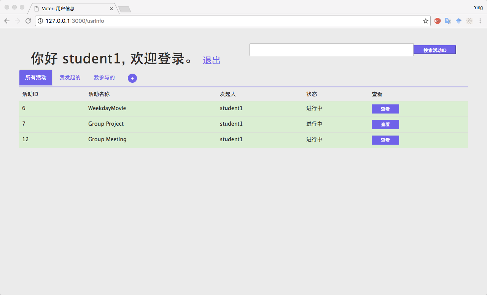

### 通过搜索活动ID加入投票
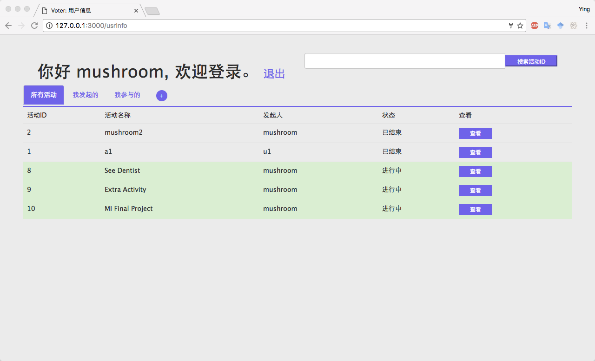
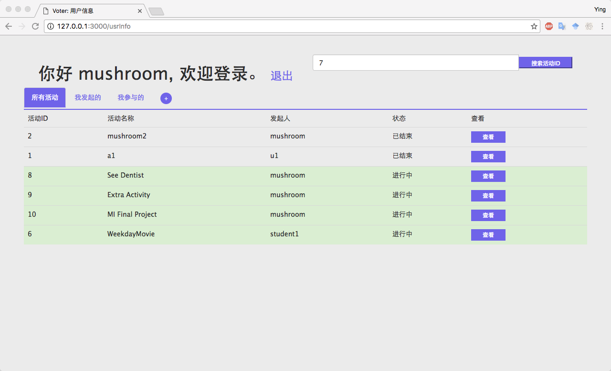
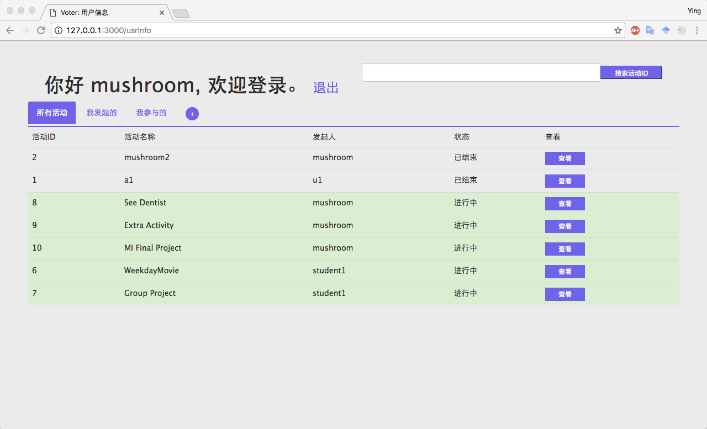

### 关闭投票
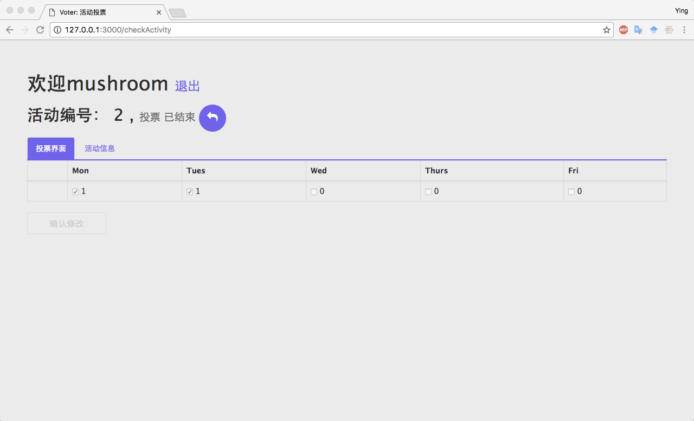


## 实现说明
网站采用nodejs的express框架，网页是ejs模板渲染，数据库使用的是mysql。

### 注册登录
用户的信息都保存在数据库Voter的userinfo表中。
登录过后给用户设置了cookie，使得短时间内无需重复登录。
为了试验方便代码里设了30分钟。

### 个人信息、发起新投票
个人信息页面会显示用户的用户名，并且有退出登录的按钮


在个人信息页面拉去了用户参与的所有投票活动。由于时间仓促，所以只实现了查看所有投票活动的功能。“我发起的”和”我参与的”两类功能上来说是类似的，从实现上来说没有什么本质的区别。

点击三个标签页旁边的加号可以发起新的投票。通过填写表单POST到后台进行数据的处理。

为了实现方便，所以只设置了一种表格模式：工作日模式。

### 通过搜索活动ID加入投票
可以通过搜索活动ID加入别人发起的投票。

### 投票界面

投票界面中会显示当前投票活动的状态（进行中/关闭），如果是发起人可以关闭投票。

关闭后的投票不能进行编辑。

此处利用sockect.io实现了有人修改同一个投票任务，并且提交的之后，会重新刷新页面。


